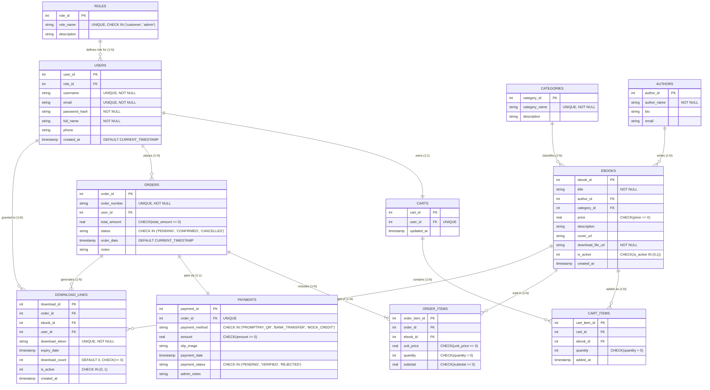

# ไดอะแกรมที่ 1: แผนภาพความสัมพันธ์ฐานข้อมูล (Entity-Relationship Diagram: ERD)
**โครงงาน:** Mini Project Database ร้านขาย E-Book  
**มาตรฐาน:** รูปแบบบรรทัดฐานขั้นที่ 3 (3NF) รองรับ SQLite3 / MySQL / PostgreSQL  

---

## 1. แผนภาพ ER Diagram (Mermaid Format)

---

## 2. สรุปความสัมพันธ์และอัตราส่วน (Cardinality Summary)
1. **ROLES (1) to USERS (N):** ผู้ใช้ 1 คนมีบทบาทเดียว แต่ 1 บทบาทมีผู้ใช้สังกัดได้หลายคน
2. **CATEGORIES (1) to EBOOKS (N):** หมวดหมู่ 1 หมวดมีหนังสือได้หลายเล่ม
3. **AUTHORS (1) to EBOOKS (N):** ผู้แต่ง 1 คนเขียนหนังสือได้หลายเล่ม
4. **USERS (1) to CARTS (1):** สมาชิก 1 คนมีตะกร้าประจำตัว 1 ตะกร้า
5. **CARTS (1) to CART_ITEMS (N) & EBOOKS (1) to CART_ITEMS (N):** ตะกร้าและหนังสือเชื่อมโยงแบบ Many-to-Many ผ่านตาราง `cart_items`
6. **USERS (1) to ORDERS (N):** ลูกค้า 1 คนสามารถมีประวัติคำสั่งซื้อได้หลายรายการ
7. **ORDERS (1) to ORDER_ITEMS (N) & EBOOKS (1) to ORDER_ITEMS (N):** รายการสั่งซื้อเชื่อมกับหนังสือแบบ Many-to-Many โดยเก็บ Snapshot ราคา ณ วันที่ซื้อ (`unit_price`)
8. **ORDERS (1) to PAYMENTS (1):** คำสั่งซื้อ 1 รายการผูกกับข้อมูลการชำระเงิน 1 รายการ
9. **ORDERS (1) to DOWNLOAD_LINKS (N):** เมื่อคำสั่งซื้อได้รับการยืนยัน จะสร้างโทเค็นดาวน์โหลดสำหรับหนังสือแต่ละเล่มในออเดอร์นั้น
