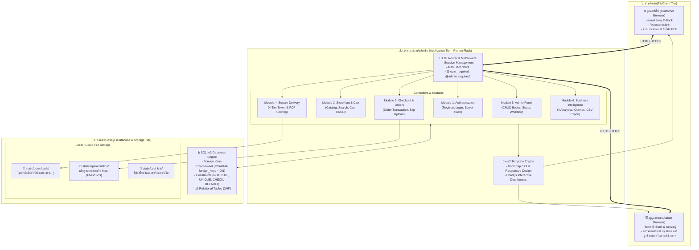

# ไดอะแกรมที่ 2: สถาปัตยกรรมระบบ (System Architecture Diagram)
**โครงงาน:** Mini Project Database ร้านขาย E-Book  
**รูปแบบ:** Multi-Tier Web Application Architecture  

---

## 1. แผนภาพสถาปัตยกรรมระบบ (System Architecture)

---

## 2. อธิบายองค์ประกอบของสถาปัตยกรรม (Architecture Layers)
1. **Client Tier:** รองรับทั้งอุปกรณ์เดสก์ท็อปและสมาร์ตโฟนผ่าน Responsive Web Design (Bootstrap 5)
2. **Application Tier:** พัฒนาด้วย Python Flask ทำหน้าที่ตรวจสอบความปลอดภัย (Session Authentication), ควบคุมเงื่อนไขทางธุรกิจ (Business Rules) และคำนวณราคา
3. **Database Tier:** จัดการด้วย SQLite3 Relational Database ที่ปฏิบัติตามมาตรฐานฐานข้อมูล มีดัชนี (Indexes) ช่วยเร่งความเร็ว และมีการใช้ Constraints ควบคุมความถูกต้อง
4. **File Storage:** แยกพื้นที่เก็บไฟล์สลิป (`uploads/slips`) และไฟล์หนังสือ (`downloads`) ออกจากตัวฐานข้อมูล เพื่อให้สอดคล้องกับหลักการออกแบบฐานข้อมูลที่ดี
