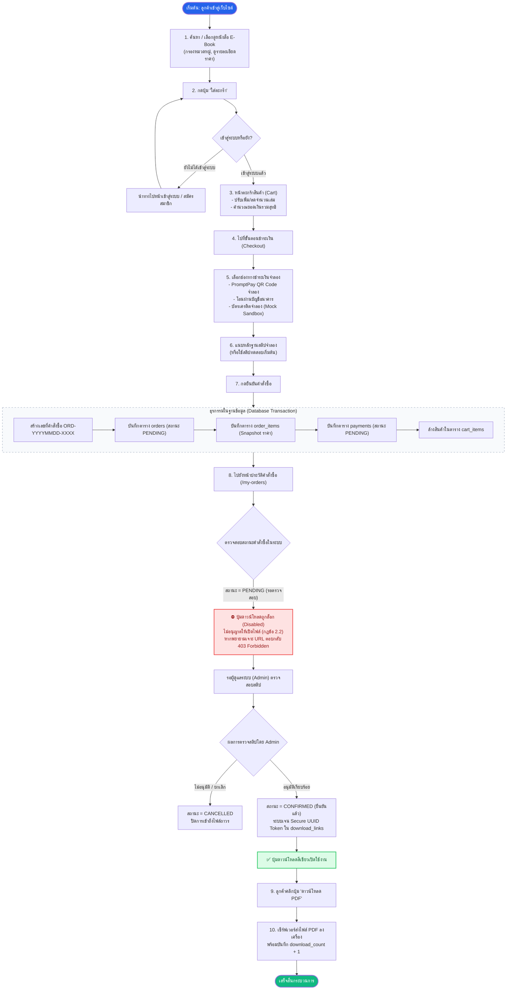

# ไดอะแกรมที่ 3: แผนผังกระบวนการสั่งซื้อและดาวน์โหลด (Customer Purchase & Download Flow)
**โครงงาน:** Mini Project Database ร้านขาย E-Book  
**หมวดหมู่:** เส้นทางการทำงานของลูกค้า (Customer Journey & Flowchart) ตามข้อกำหนดหัวข้อ 2.1 และ 2.2  

---

## 1. แผนผังกระบวนการสั่งซื้อและรับไฟล์ E-Book (Flowchart)

---

## 2. จุดเด่นและกติกาสำคัญในกระบวนการ (Key Business Rules)
1. **การจำลองการชำระเงินที่ปลอดภัย (Simulation):** ไม่มีการเก็บข้อมูลบัตรเครดิตหรือข้อมูลบัญชีจริง เพื่อให้สอดคล้องกับข้อกำหนดวิชา
2. **การ Snapshot ราคาประวัติ (`unit_price`):** ข้อมูลราคาที่ซื้อจะถูกบันทึกแยกต่างหากจากตารางหนังสือ เพื่อไม่ให้ประวัติยอดขายคลาดเคลื่อนหากมีการปรับราคาในอนาคต
3. **การบังคับใช้กฎข้อ 2.2 อย่างเข้มงวด:** ระบบควบคุมสิทธิ์ทั้งในระดับ UI (ปุ่มล็อก) และระดับเซิร์ฟเวอร์ (ปฏิเสธ HTTP 403) ทำให้ผู้ใช้ไม่สามารถแอบเปิดไฟล์ได้ก่อนแอดมินยืนยัน
