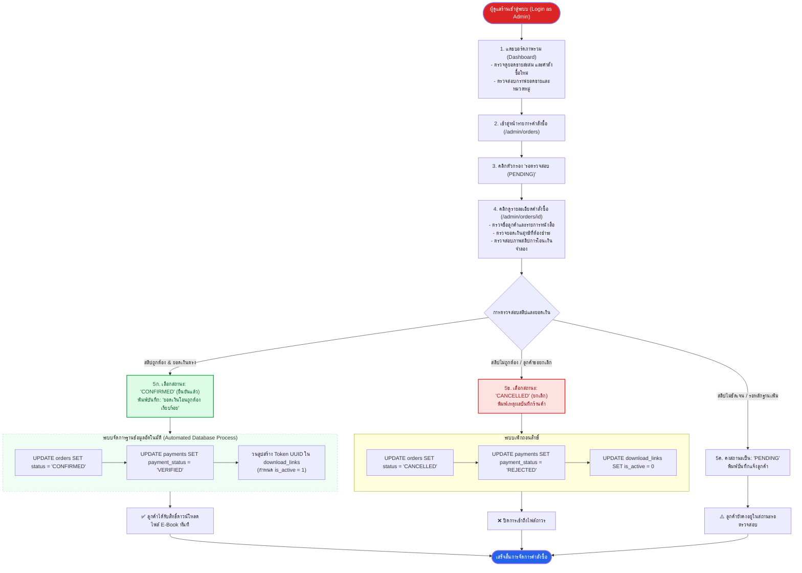

# ไดอะแกรมที่ 4: แผนผังกระบวนการตรวจสอบคำสั่งซื้อของผู้ดูแลร้าน (Admin Verification Flow)
**โครงงาน:** Mini Project Database ร้านขาย E-Book  
**หมวดหมู่:** เส้นทางการทำงานของผู้ดูแลร้าน (Admin Journey & Workflow) ตามข้อกำหนดหัวข้อ 3  

---

## 1. แผนผังกระบวนการทำงานของผู้ดูแลร้าน (Flowchart)

---

## 2. ลำดับการเปลี่ยนสถานะ (State Machine Transitions)
* **PENDING $\rightarrow$ CONFIRMED:** ยอดเงินถูกต้อง $\rightarrow$ สร้างโทเค็นและเปิดการดาวน์โหลด
* **PENDING $\rightarrow$ CANCELLED:** สลิปปลอมหรือลูกค้าไม่ชำระ $\rightarrow$ ปิดบิลและระงับการดาวน์โหลด
* **CONFIRMED $\rightarrow$ CANCELLED:** กรณีขอคืนเงิน $\rightarrow$ เพิกถอนสิทธิ์ในตาราง `download_links` ทันที (`is_active = 0`)
