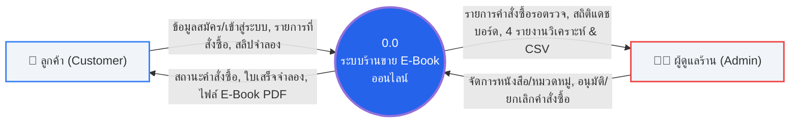
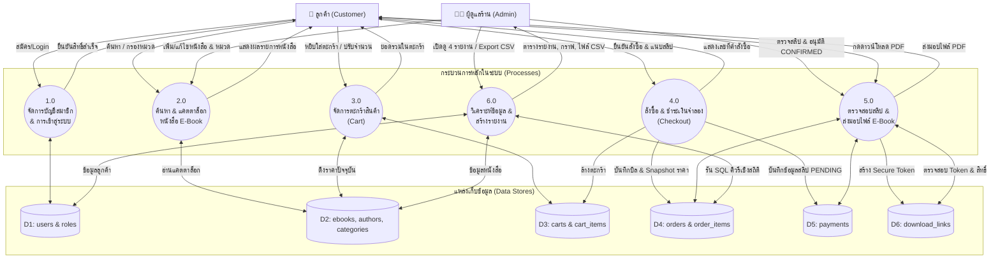

# ไดอะแกรมที่ 5: แผนภาพกระแสข้อมูล (Data Flow Diagram: DFD Level 0 & Level 1)
**โครงงาน:** Mini Project Database ร้านขาย E-Book  
**มาตรฐาน:** แผนภาพแสดงทิศทางการไหลของข้อมูลระหว่าง Entity, Process และ Data Store  

---

## 1. DFD Level 0 (Context Diagram - ภาพรวมระดับสูงสุด)

---

## 2. DFD Level 1 (แผนภาพกระแสข้อมูลระดับกระบวนการย่อย)

